#  Machine Learning Pipeline

20 November 2018

This R program allows rapid assessment of a variety of machine learning algorithms for classification and regression predictions.     

Author: Neal Cariello, Senior Toxicologist at Integrated Laboratory Systems (https://ils-inc.com/)    
Supporting the NTP Interagency Center for the Evaluation of Alternative Toxicological Methods (NICEATM) (https://www.niehs.nih.gov/research/atniehs/dntp/assoc/niceatm/index.cfmv)    

NICEATM is an office within the division of the National Toxicology Program at the National Institute of Environmental Health Sciences (https://www.niehs.nih.gov/index.cfm)

EMAIL: neal.cariello@gmail.com

Please see Figure 1 for the typical state of the author. 

  
Figure 1. Author after way too much coffee

**Please see _**Caret Generic Workflow Documentation 2018_10_29.docx**_ in the documentation subdirectory to get started.**

## To Get The Files Use Git Or Download Directly
**TIP**: If you don't know what Git is, use the direct download method as shown in Figure 1.

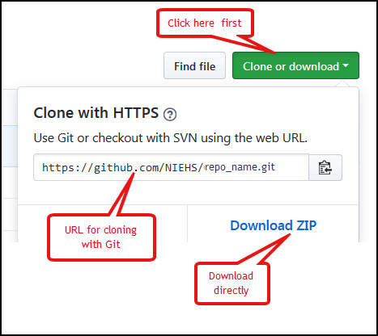    
Figure 1.  Download options.

Subdirectories needed to run the code are shown in Figure 2.

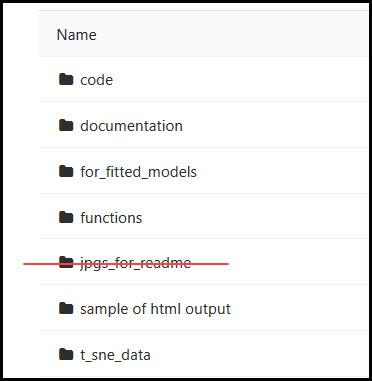   
Figure 2. Required subdirectories

## Summary

This R program allows rapid assessment of a variety of machine learning algorithms for classification and regression predictions.  
 
The classification and regression models are used to generate predictions for different data types:  

* The classification model in this pipeline generates predictions for a binary outcome (0/1, TRUE/FALSE, toxic/non-toxic, etc.)
    * The R datatype must be a factor with two levels
    * The program has not been tested with factors of three or more levels
* The regression model predicts a number
    * The R datatype must be integer or numeric
    

The R package ``caret`` (http://http://topepo.github.io/caret/index.html) is used extensively which greatly simplifies coding.  A machine learning book by the ``caret`` author is highly recommended and is available on Amazon 
(https://www.amazon.com/Applied-Predictive-Modeling-Max-Kuhn/dp/1461468485)    

Multiple machine learning algorithms can be used to easily evaluate different models using the syntax:    
``MLmethods <- c('rf', 'svmRadial', 'xgbLinear', ...)``   

All data must be an integer or numeric R data type with the exception of the outcome being predicted. Other R factor variables in the dataset are automatically deleted.  

R Markdown is used so all code and output is in a single HTML file for easy documentation. The R environment is saved so that the code does not have to be executed to examine the models.
The code can take many hours to execute depending on the size of the data and the machine learning methods selected.


## User Options And Program Features

### Use Datasets That Have Been Tested With The Program 

The program has been tested with a classification and regression dataset in two R packages.  Before running the program with user data,
it is strongly recommended to execute the program using tested datasets.  This is set in code by  
```USE_DEFAULT_DATA <- TRUE / FALSE```

### Select Classification Or Regression Model

This is set by executing one of the lines below:    
```MODEL <- 'CLASSIFICATION'```   
```MODEL <- 'REGRESSION'```

### Specify Machine Learning Algorithms 

Multiple machine learning algorithms can be used to easily evaluate different models using the syntax:    
``MLmethods <- c('rf', 'svmRadial', 'xgbLinear', ...)``.  

Not all algorithms will work with a given dataset.    
237 algorithms that can be used with ``caret`` are given at http://topepo.github.io/caret/available-models.html  

### Evaluation Of Training Models

By default, a 10-fold cross validation step repeated 5 times is used. This is set in the function ```ModelFit()```.  Other options can be used.


### Missing Value Imputation 

Data for modeling must not contain any missing values.  Missing values are automatically detected and imputed or deleted in order as follows:   

* Rows with > 10% missing values are deleted  
* Columns with > 10% missing values are deleted
* Missing values are imputed using the k-Nearest Neighbor (kNN) method in the R package ``DMwR``
    * If the data has so many missing variables that the kNN method fails, median imputation from the R package ``imputeTS`` is used
    
There is no option to disable missing value imputation.

### Data Standardization 

By default, the input data is scaled to create a standardized normal distribution for each variable.  Each variable will have a mean of 0 and a standard deviation of 1. This is also called a Z-score scaling.  

Scaling occurs in the ``Model Fit()`` function.  Other scaling methods can be implemented in the function.

### Remove Variables With Near Zero Variance 

Variables with near zero variance have little information.  Removing these variables will speed up computation. Variables removed are listed as the program runs. This option is implemented in code as   
```REMOVE_LOW_VARIANCE_COLS <- TRUE / FALSE```  

### Remove Highly Correlated Variables 

It is important to remove highly correlated variables.
These variables may be reporting on the same property.  If all variables are used in the model it may inflate model performance,
that is, the model will look like it performs better than it actually does. Variables removed are listed as the program runs.

This option is implemented in code as    
```REMOVE_HIGHLY_CORRELATED_COLUMNS <- TRUE / FALSE```  

### Visualize Classification Data
Principal Component Analysis (PCA) and t-Distributed Stochastic Neighbor Embedding (t-SNE) plots are produced for the **classification model only**.  This is controlled in code by    
```VISUALIZATION <- TRUE / FALSE```

### Datasets For Training and Testing
By default, the data is randomly split into a training dataset (75% of data) and a testing dataset (25% of data).  This can be changed in code.  

###  Parallel CPU Processing 
Enabling this option will speed up computation and is set in code by  
```PARALLEL <- TRUE / FALSE```


## Outputs

### Variable Correlation

A plot of the correlation of the variables is generated as shown in Figure 3. 

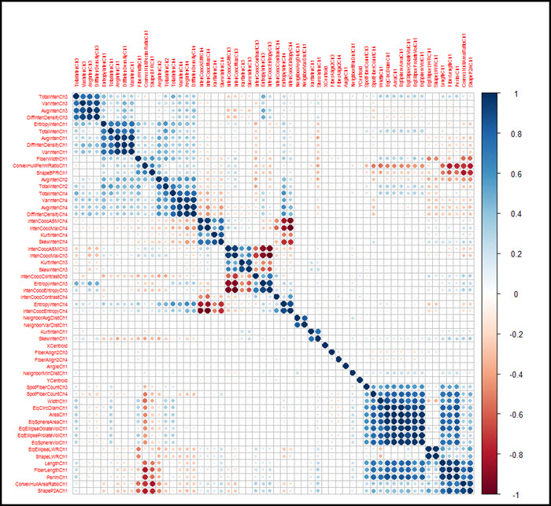    
Figure 3.  Variable correlation in the default classification dataset.  Positively-correlated variables are in blue and anti-correlated variables are in red. 


### Variable Distribution  

A histogram of variable distributions is plotted as shown in Figure 4.  

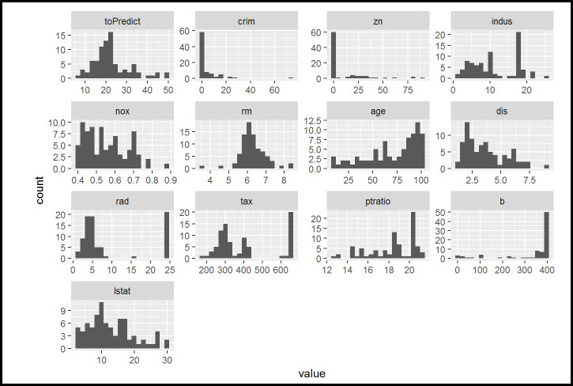    
Figure 4. Histogram of variable distributions from the default regression dataset.

### Variable Statistics

Simple variable statistics are produced as shown in Figure 5. 

    
Figure 5.  Variable statistics.

### PCA And t-SNE Plots
These visualization plots will be generated **only** for classification datasets.     
Principal Component Analysis (PCA) uses linear relationships between variables while t-Distributed Stochastic Neighbor Embedding (t-SNE) can detect non-linear relationships.  In cases where non-linear relationships between variables exsit, t-SNE can be far superior to PCA.   

The MNIST image digit recognition dataset is used for illustration.  This dataset is handwritten images of the digits 0-9.  

The PCA plot is given in Figure 6 and shows poor separation of the digits and little structure in the dataset.  
The t-SNE plot is shown in Figure 7 and good separation of the digits is achieved.   

Since the dataset has many non-linear relationships, PCA fails to discern any structure while t-SNE reveals the structure in the dataset.  
   
Code to generate these figures is in the ``visualization.R`` file.

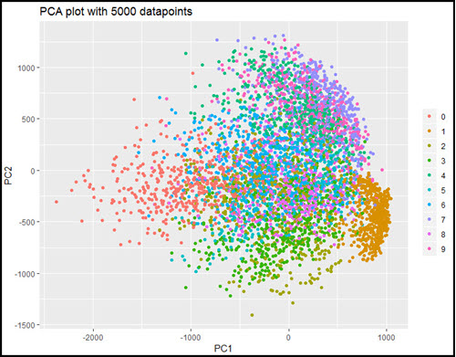    
Figure 6.  PCA plot of MNIST dataset for images of the digits 0-9. 

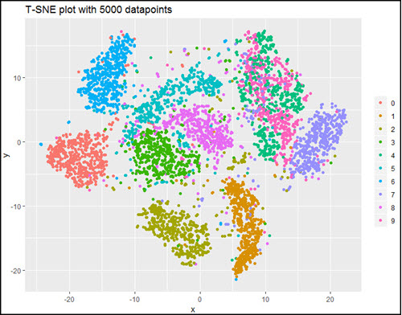    
Figure 7.  t-SNE plot of the MNIST dataset for images of the digits 0-9.

### Training Models: Tuning Parameters and Variable Importance
The ``caret`` package computes training performance with several auto-selected tuning parameters, and chooses the best tuning parameter.  An example is shown in Figure 8.

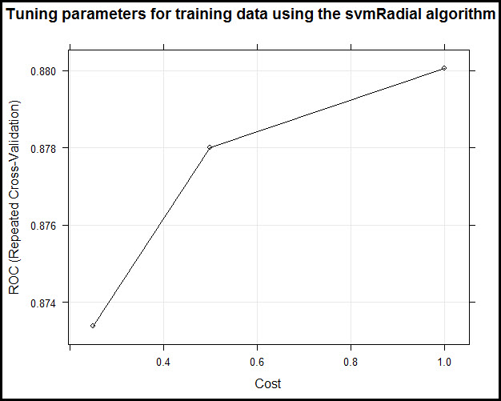    
Figure 8. Three tuning parameters for the Support Vector Machine with a Radial Kernel (svmRadial) were auto-selected.  The third tuning parameter from the left with a y-axis value of 0.88 is the best and this tuning parameter is used in model construction.  


Variable importance is useful to understand what variables are contributing most to a training model and an example is shown in Figure 9.     

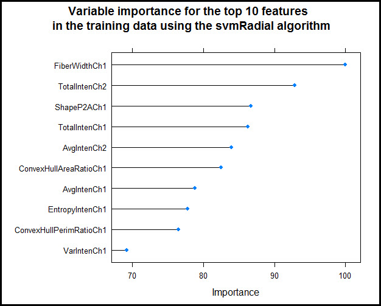    
Figure 9. Variable importance for the classification dataset.  FiberWidthCh1 contributes the most to the model.   


### Training Data Performance

Different performance metrics are used for the training data for classification and regression models.  The metrics for the training classification model are given in Figure 10.  

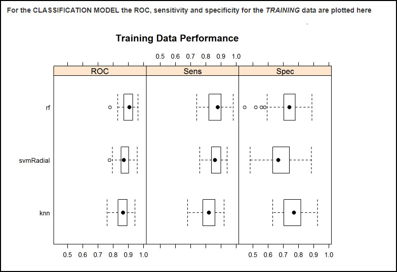    
Figure 10.  Classification training dataset characteristics for three machine learning algorithms are shown, namely Random Forest (rf), Support Vector Maching with a radial kernel (svmRadial) and k-Nearest Neighbor (knn).  The Receiver Operating Characteristic (ROC), Sensitivity (Sens) and Specificity (Spec) for the training data are plotted.  The Random Forest model has the highest ROC value and is therefore can be considered the best model. 

Metrics for the training regression model are shown in Figure 11.   

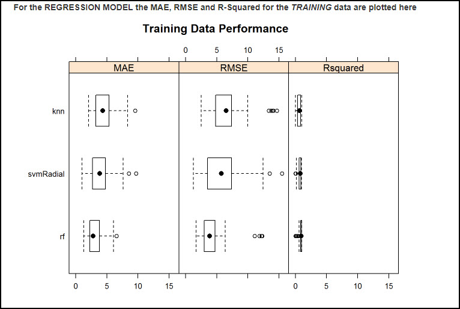    
Figure 11.  The Mean Absolute Error (MAE), Root Mean Squared Error (RMSE) and Pearson R-Squared for the regression training dataset are plotted. Three algorithms are shown, namely Random Forest (rf), Support Vector Machine with a radial kernel (svmRadial) and k-Nearest Neighbor (knn).  The Random Forest model has the lowest RMSE the lowest MAE and the highest R-Squared and is therefore the best model.  

### Testing Data Performance

Different metrics are used for the testing data for classification and regression models and the metrics are given in Figures 12 and 13.  

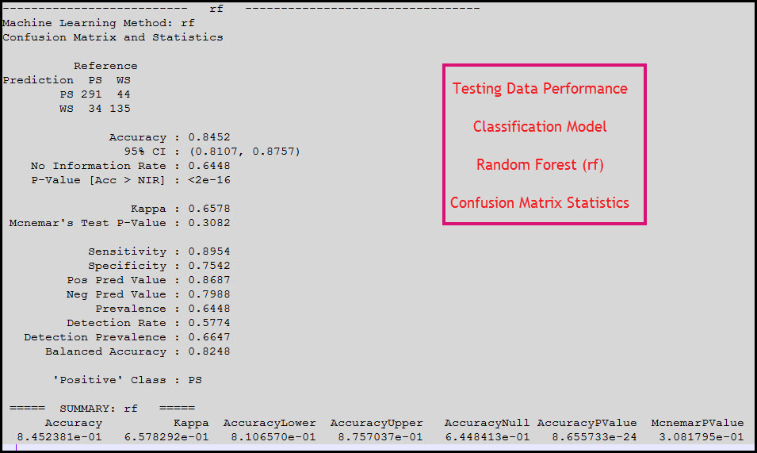  
Figure 12. Testing data metrics for the classification model. 


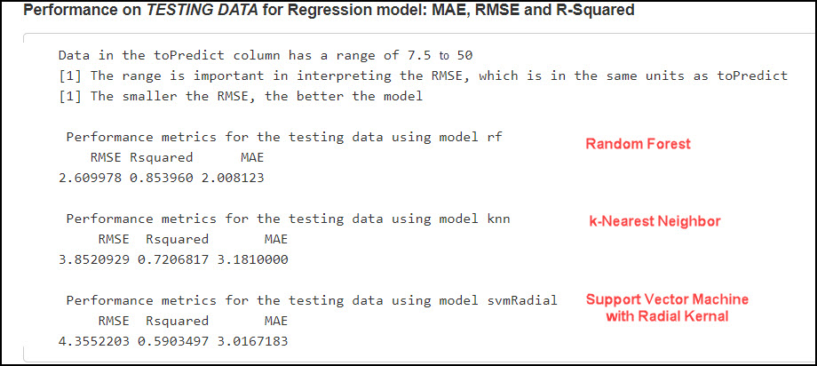  
Figure 13.  Testing data metrics for the regression model. The Mean Absolute Error (MAE), Root Mean Squared Error (RMSE) and Pearson R-Squared are plotted.

### Highly recommended book by Max Kuhn, the author of the ``caret`` package  
The ``caret`` package is used extensively in this code and greatly simplifies many aspects of machine learning coding.    

A book by the author of the ``caret`` R package, Max Kuhn, is highly recommended and it is available from Amazon.com:
https://www.amazon.com/Applied-Predictive-Modeling-Max-Kuhn/dp/1461468485 
This book provides very good explanations of machine learning principles and the code examples use the ``caret`` package.   

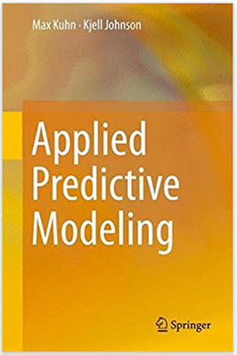


**AND ALWAYS REMEMBER TO HAVE FUN !!**


